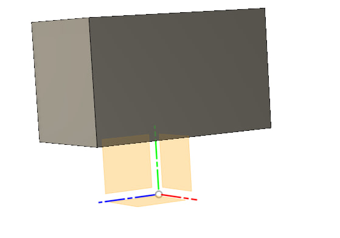
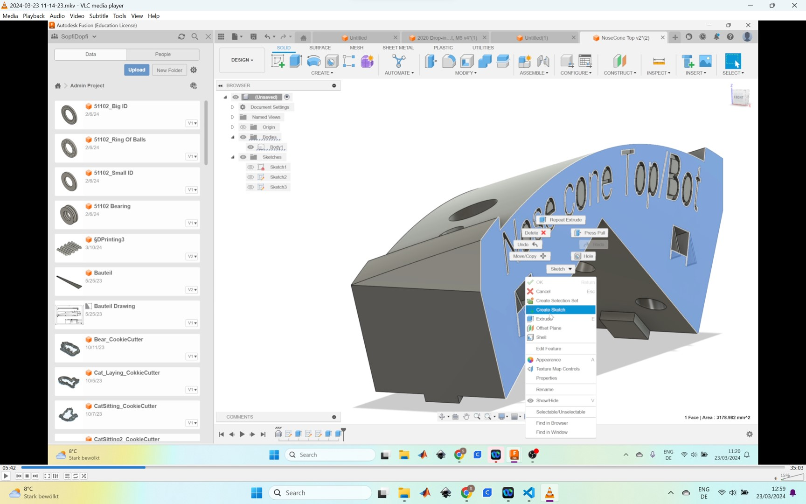
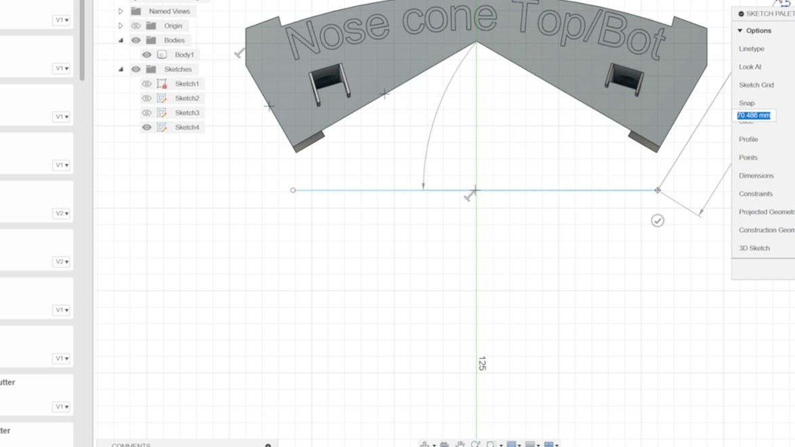
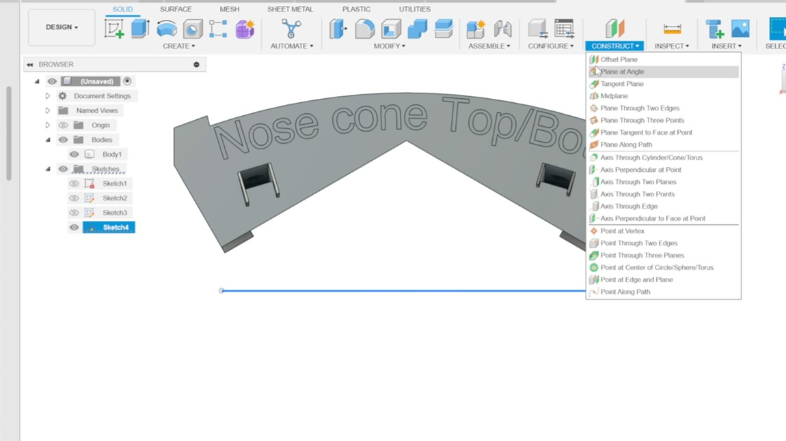
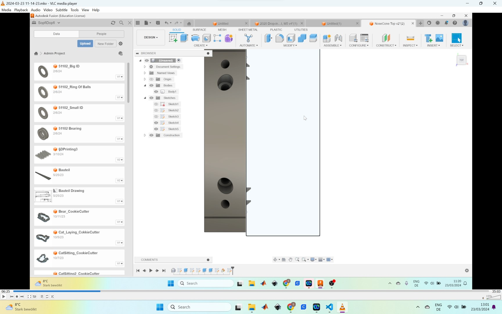
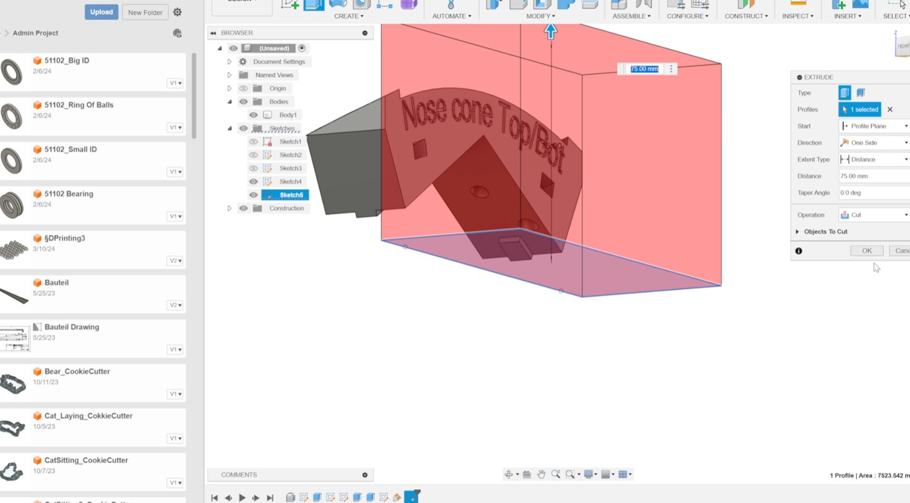
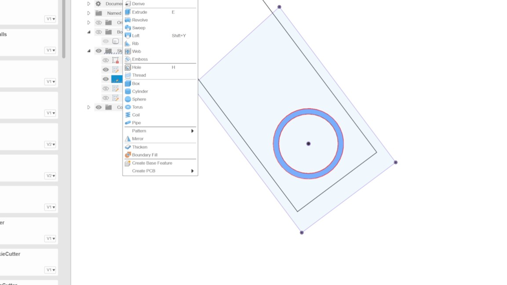
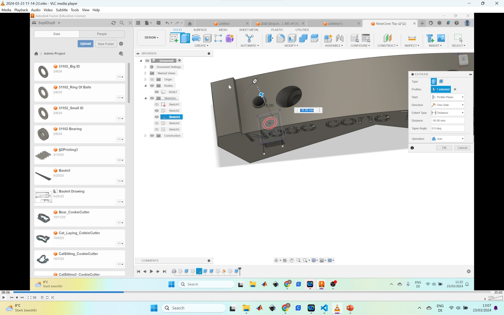
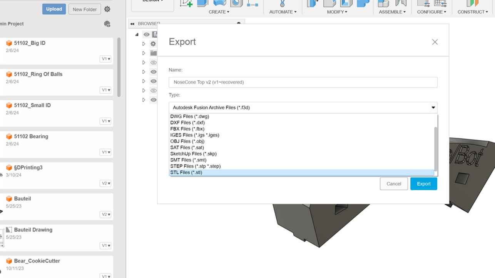

# Changes to be done 
To start with Assembly, the first thing to do is introduce a new component. Although it might seem simple, there's an important initial step before diving into sketch creation  <b>ASSIGN A NEW SYSTEM OF COORDINATES!</b>

For instance, let's explore how to add a new component onto Chelonia's aluminum extrusion.
1             |2
:-:|:-:
 Open the cloud -> right click -> Insert into current design. Allign if needed. |   With the extrude tool click on any Surface. By selecting "Object" in Start parametr an arbitrary plane or surface might be chosen.
3           |4
 Assemble -> New component.  a new component should be visible in the construction tree. |  After selecting ZY plane the sketch to be extruded is finshed.

now let's make visible only new component and its system of coordinates.

The outcome is that the SoC of the new component aligns with the global System of Coordinates of the entire assembly. However, this approach presents several drawbacks:

<ul>
  <li>It becomes less convenient to directly work with CAD/CAM/CAE tools on the individual part itself.</li>
  <li>The planes of symmetry of the component are affected.</li>
</ul>
Consequently, each time the file of this component is opened, numerous issues arise, such as aligning its SoC, which may not correlate with the geometry of the component, as it is defined by the SoC of the initial assembly.

Tipps:
Useful tipp 1             |Useful tipp 2
:-:|:-:
 Visibility of a body/sketch/origin/component/etc is controlled by the "eye" button |   Clicking "Active" on the root element will turn off the transparency of other components.

7         |8
 Now we want to remove the small edges created by the extrusion. Start a sketch on the plane of the connecting part.  |  Create a simple line.
9        |10
 Finish the sketch and Go to "Offset Plane" and create a "Plane at Angle" click on the line and have a look if the create plane is parallen to the x-y-plane of the connecting part. If not, adjust the angle  |  Create a sketch on this plane and create a simple rectangle were one edge is dirctly on the face of the connecting part.
11        |12
 Extrude the rengle and use the "Cut" function of the extrusion. | Then extrude the ring face to create smaller hole for the bolt ( do not forget the "Joint" Function)
13       |14
 Extrude the rengle and use the "Cut" function of the extrusion. |  Last step for the 3D printing is to export the part as an .stl so you can import it into a slicer software. 

LOL TEST
