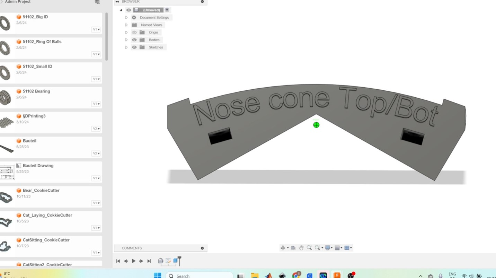
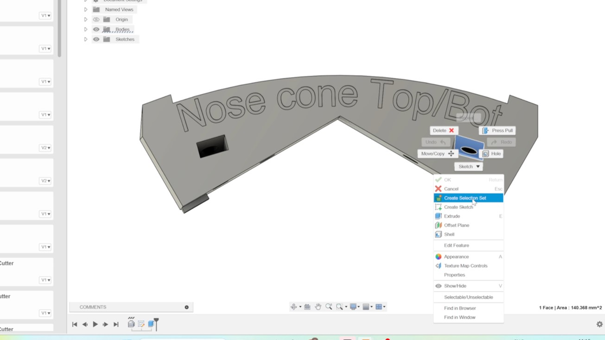
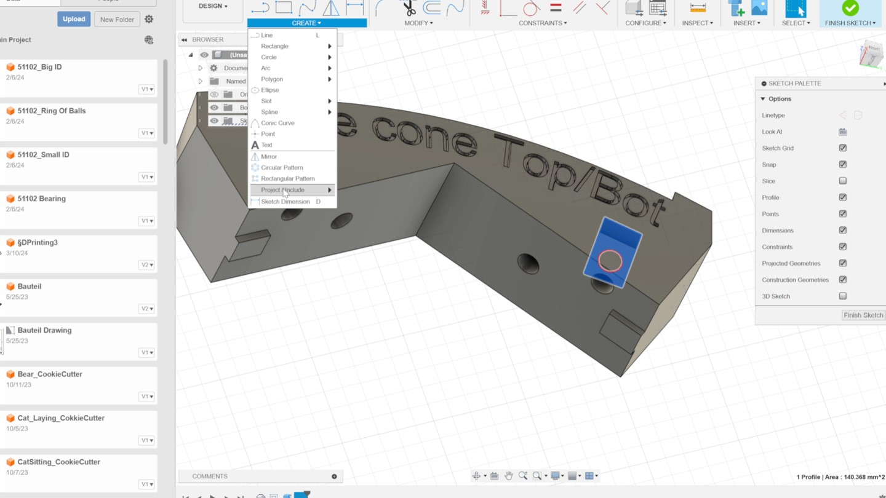
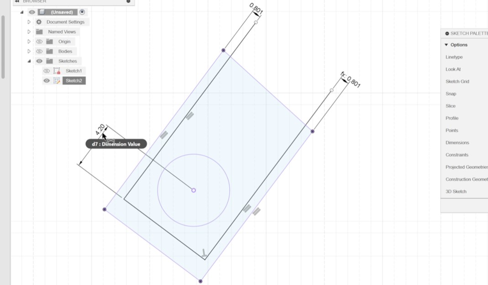
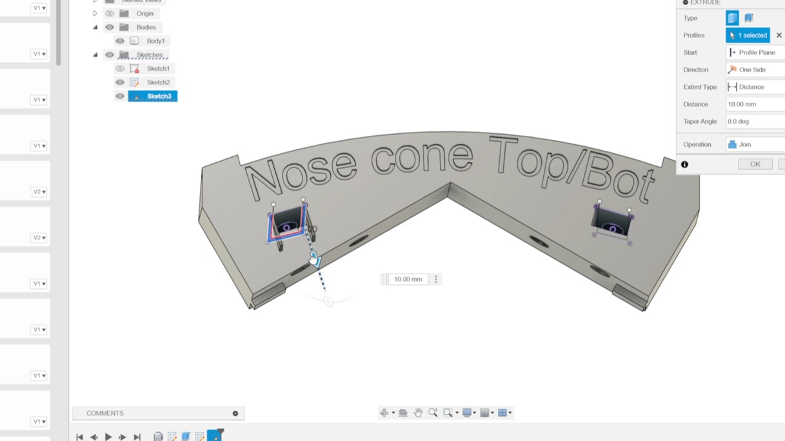

# Changes to be done 
The first step in Assembly is adding a new component.Eventhough it doesnt look complecated, one very import step before starting creating a sketch must be complited. ASSIGN NEW SYSTEM OF COORDINATE!

For example lets take a look at adding a new component on a piece of Chelonia's aluminum extrusion:
1             |2
:-:|:-:
 Open the cloud -> right click -> Insert into current design.\n Allign if needed. |  Open it as a project (go to "File" and "Open") on your personal Fusion account.
3           |4
 Click on the upper surface inside  the part with the hole were the nut will be inserted. Go  with right click to "Create a new Sketch"  |  To make the whole body of hte connecting part invisible and just see the line of the surface, Go To " "Create" and click on "Project/Insert" and choose the surface.
5          |6
 Create three lines and use the measurements taken from the new nut used (I used a tolerance of 0.5 mm on each side). Make sure the contrains are right (parrallel lines).  |  Finish the sketch and got to "Extrude", then click on the surface area created by the 3 lines and extrude it with the "Joint" function (see window on the right side)
7         |8
 Now we want to remove the small edges created by the extrusion. Start a sketch on the plane of the connecting part.  |  Create a simple line.
9        |10
 Finish the sketch and Go to "Offset Plane" and create a "Plane at Angle" click on the line and have a look if the create plane is parallen to the x-y-plane of the connecting part. If not, adjust the angle  |  Create a sketch on this plane and create a simple rectangle were one edge is dirctly on the face of the connecting part.
11        |12
 Extrude the rengle and use the "Cut" function of the extrusion. | Then extrude the ring face to create smaller hole for the bolt ( do not forget the "Joint" Function)
13       |14
 Extrude the rengle and use the "Cut" function of the extrusion. |  Last step for the 3D printing is to export the part as an .stl so you can import it into a slicer software. 

LOL TEST
