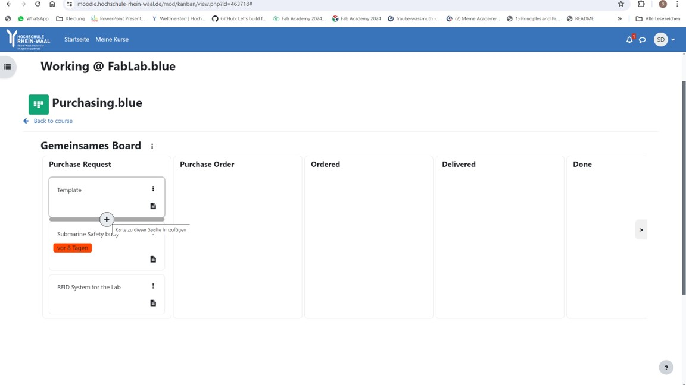
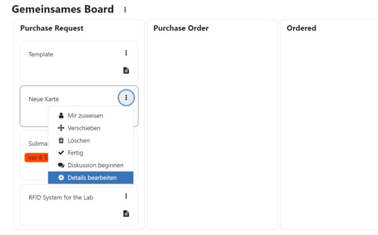
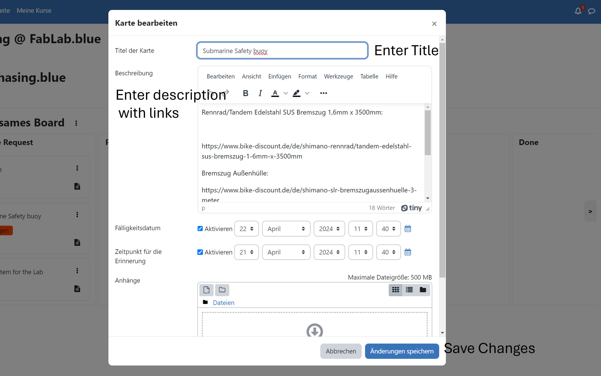

# Tutorial to request and buy Parts
To Buy parts you have to use this website: https://moodle.hochschule-rhein-waal.de/mod/kanban/view.php?id=463718
If you do not have access to this website please request it and write an email to Prof. William Megill with the information that you are from the submarien team.
wmm@hsrw.eu

1             |2
:-:|:-:
 Create a new template in the "Purchase Request" column |  Click on "Details bearbeiten" to change the 
details of the template.
3           |4
 Change the details as needed  | 

