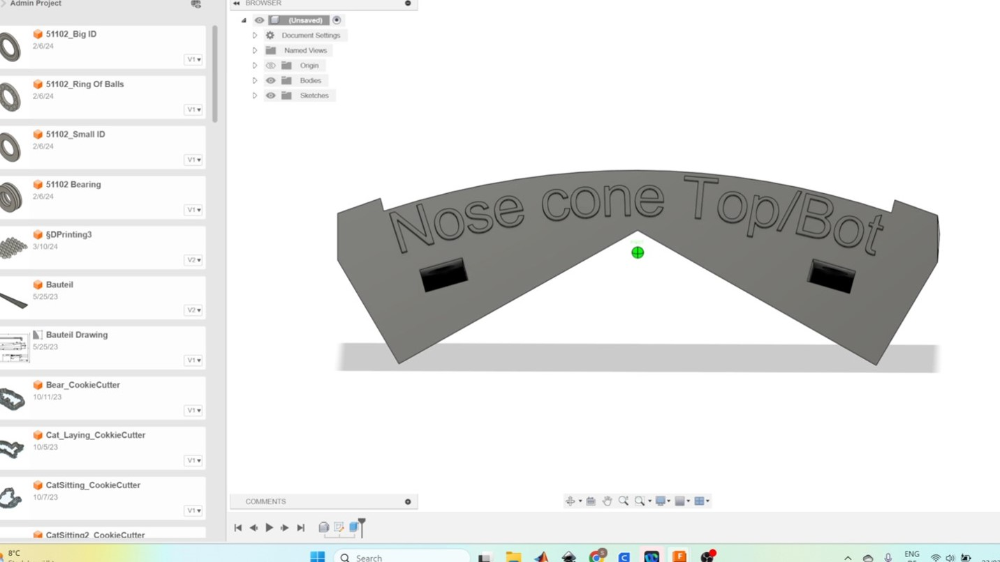
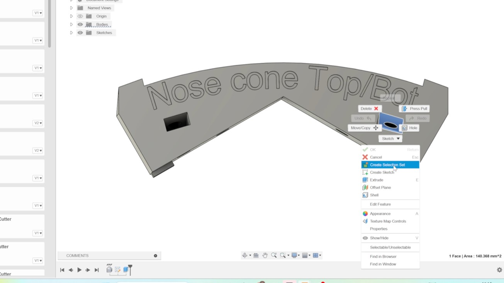
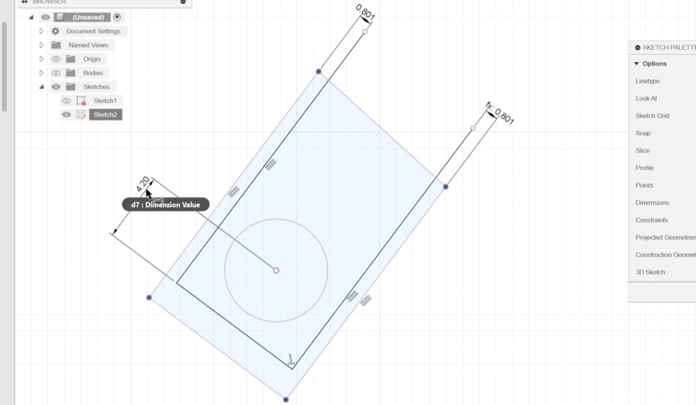
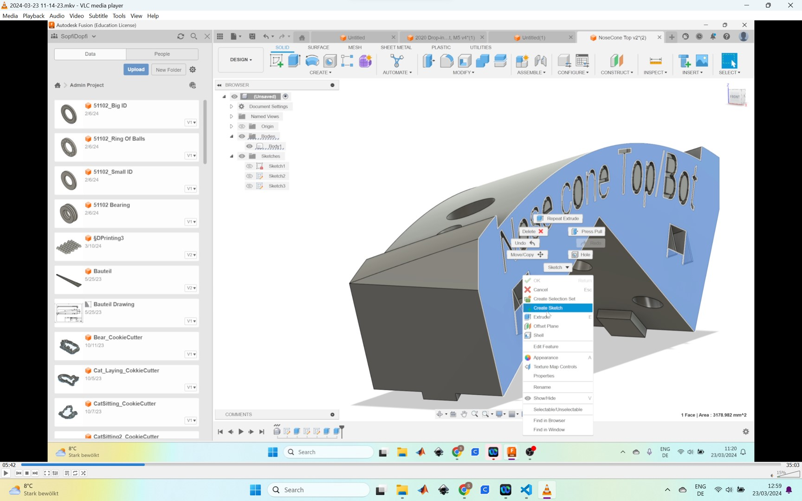
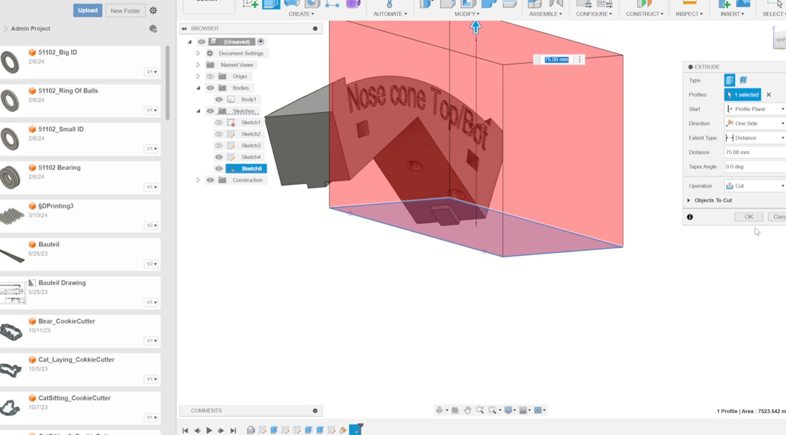

# Changes to be done 
The connection parts are the pieces between the frame and the hull to mount the frame sheet onto the hull. Originially, the parts are meade of ASA and a bold and nutis used to connect the frame sheet with the connection part.

In the previous design, a standard hex M6 nut was utilized. However, due to exposure to saltwater in the submarine's environment, these nuts corroded over time. The resulting corrosion increased the torque required to unscrew the nut from the bolt to such an extent that it caused damage to the connecting parts during attempts to remove the hull from the frame.

To prevent a recurrence of this issue during future disassembly operations, it is imperative to replace the existing nuts with alternatives that offer a stronger surface connection to the connecting parts. This enhancement will bolster the assembly's ability to withstand the torque applied during disassembly, thereby averting potential damage.

Utilizing 4040 Aluminum Profile T-Slot Nut M5 Half Round Spring T nuts for this purpose and in general in our submarine offers numerous advantages. These components facilitate easy restocking and maintenance, ensuring seamless operations even in challenging underwater environments. Their modular design allows for swift replacement of parts when needed, contributing to efficient upkeep and prolonged service life of the submarine. Additionally, the robustness and corrosion-resistant properties of these nuts enhance the overall reliability and durability of our equipment.
# Fusion 
1             |2
:-:|:-:
 Start with exporting the design from the shared project to your local computer. |  Open it as a project (go to "File" and "Open") on your personal Fusion account.
3           |4
 Click on the upper surface inside  the part with the hole were the nut will be inserted. Go  with right click to "Create a new Sketch"  |  To make the whole body of hte connecting part invisible and just see the line of the surface, Go To " "Create" and click on "Project/Insert" and choose the surface.
5          |6
 Create three lines and use the measurements taken from the new nut used (I used a tolerance of 0.5 mm on each side). Make sure the contrains are right (parrallel lines).  |  Finish the sketch and got to "Extrude", then click on the surface area created by the 3 lines and extrude it with the "Joint" function (see window on the right side)
7         |8
 Now we want to remove the small edges created by the extrusion. Start a sketch on the plane of the connecting part.  |  Create a simple line.
9        |10
 Finish the sketch and Go to "Offset Plane" and create a "Plane at Angle" click on the line and have a look if the create plane is parallen to the x-y-plane of the connecting part. If not, adjust the angle  |  Create a sketch on this plane and create a simple rectangle were one edge is dirctly on the face of the connecting part.
11        |12
 Extrude the rengle and use the "Cut" function of the extrusion. | Then extrude the ring face to create smaller hole for the bolt ( do not forget the "Joint" Function)
13       |14
 Extrude the rengle and use the "Cut" function of the extrusion. |  Last step for the 3D printing is to export the part as an .stl so you can import it into a slicer software. 

LOL TEST